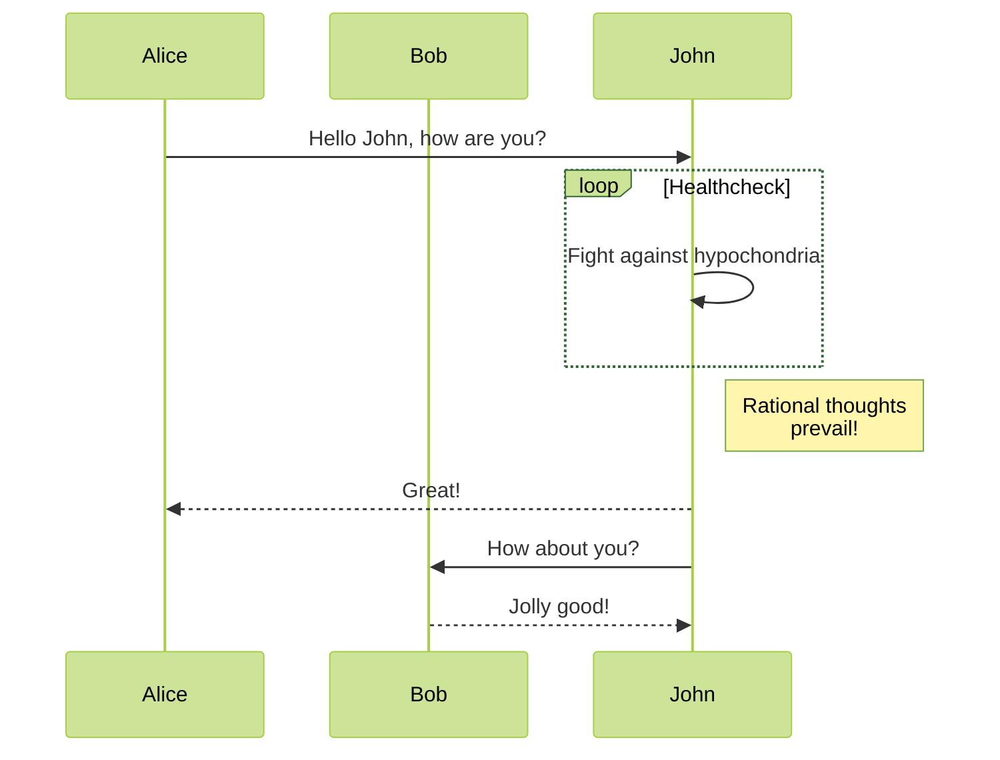
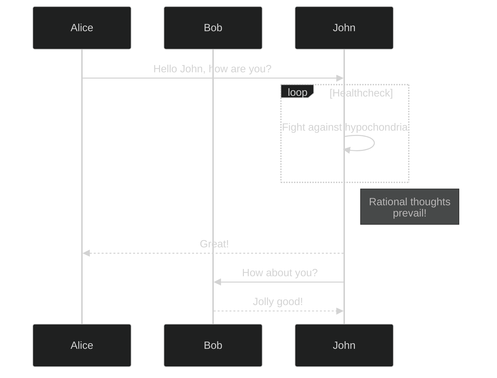

+++
title = 'Adding Mermaid and other Diagrams'
date = 2024-01-20T20:24:18Z
draft = false
+++

## Mermaid
Using [this help post](https://discourse.gohugo.io/t/correct-way-to-embed-mermaid-js/43491/11) I'll try and add mermaid diagrams to this blog.

Themes can also be set for the diagrams by adding in `%%{init: {'theme':'[theme.name]'}}%%` to the code block





## GoAT diagrams
[GoAT](https://github.com/bep/goat) diagrams are supported natively, which is great!

```goat
 ┌────────────────────┐               ┌────────────────────┐
 │                    │               │                    │
 │                    │               │                    │
 │   Box 1            ├───────────────┤     Box 2          │
 │                    │               │                    │
 │                    │               │                    │
 └───────▲────────────┘               └──────────┬─────────┘
         │                                       │
         │                                       │
         │                                       │
         │                                       │
┌────────┴────────────┐               ┌──────────▼─────────┐
│                     │               │                    │
│                     │               │                    │
│    Box 3            │               │    Box 4           │
│                     ◄───────────────┤                    │
│                     │               │                    │
└─────────────────────┘               └────────────────────┘
```
To generate this I used [asciiflow](https://asciiflow.com/#/) to create the diagram, then you can just paste it into a `goat` code block. 

This [tool](https://arthursonzogni.com/Diagon/#Math) allows you to create all kinds of ASCII art, including formulas and such.

```goat
/n\        n!      
| | = -------------
\k/   k! . (n - k)!

```